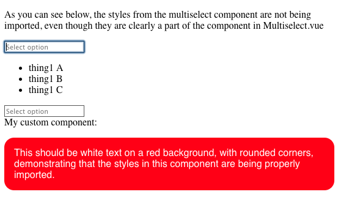

Demo to show that the styling in the `<style>` block in `Multiselect.vue` is not included in the output.

To use:

Clone the repo. From the commandline run `make install`, followed by `make docker-start`, and then `make build`. Hit [localhost](http://localhost) and observe that the multiselect components are not styled, yet the other custom component is.

Screenshot:
